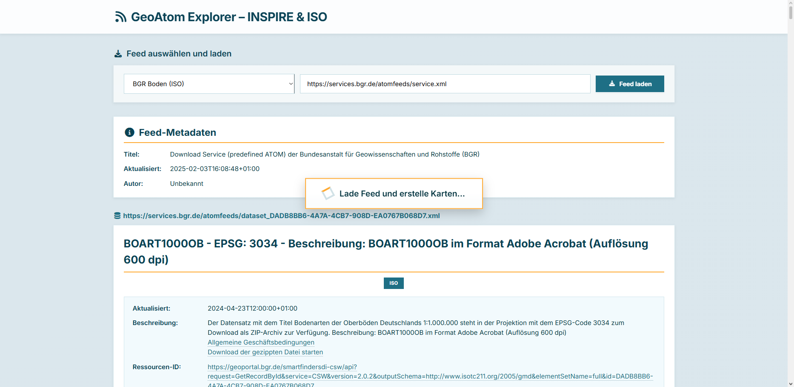
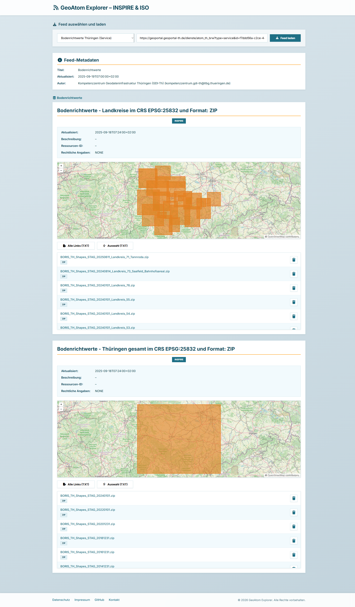
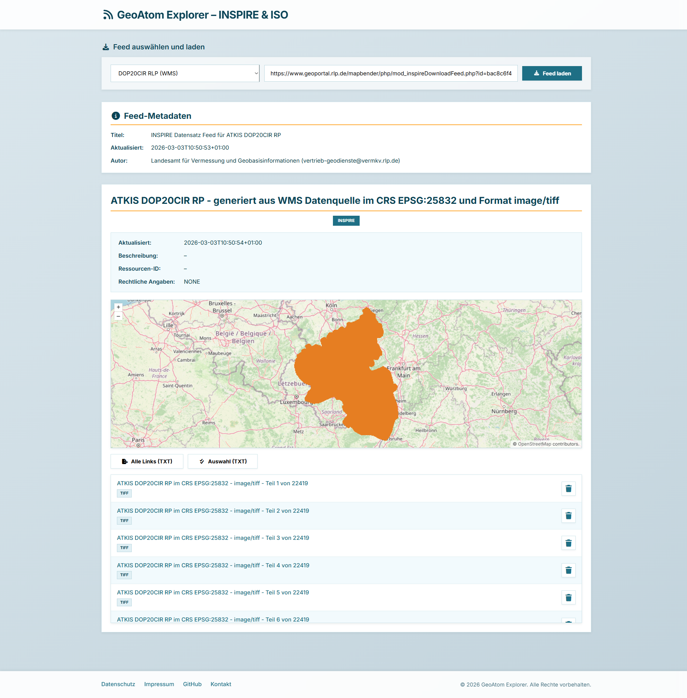
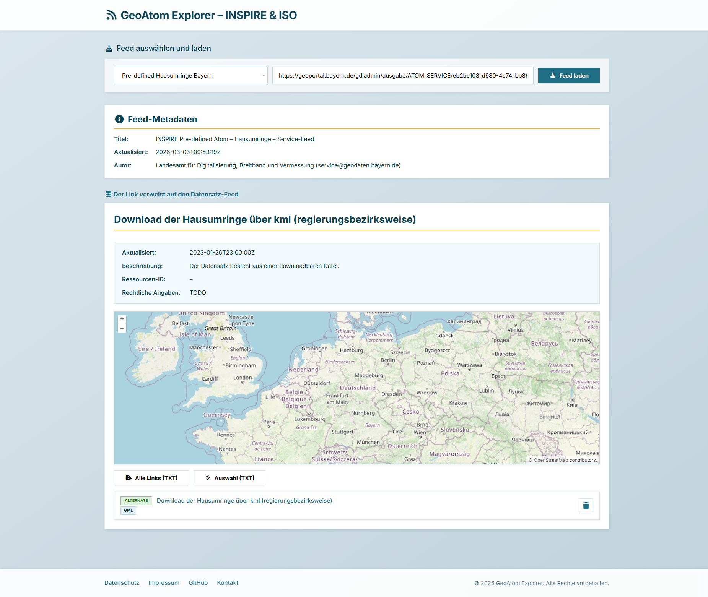

# GeoAtom-Explorer

---

## Geodaten professionell entdecken, visualisieren und herunterladen

**GeoAtom-Explorer** ist Ihre Enterprise-Lösung für die strukturierte Nutzung von INSPIRE‑ und ISO‑Atom-Feeds.
Sie erhalten:

* Sofort nutzbare Visualisierung von Geodaten auf einer interaktiven Karte
* Vollständig vorstrukturierte und bereinigte Metadaten
* Enterprise-geeignete Infrastruktur mit Proxy, Download-Management und Exportfunktionen

Ideal für Behörden, Planungsbüros, Ingenieurdienstleister oder Unternehmen – **rechtssicher, performant und professionell**.

---

# 🖥️ Showcase – Praxisbeispiele

## 1️⃣ Bundesanstalt für Geowissenschaften und Rohstoffe (BGR)

Darstellung geowissenschaftlicher Daten der BGR.

## 2️⃣ Bodenrichtwerte Thüringen (BRW_TH)

Visualisierung der Bodenrichtwerte in Thüringen.

## 3️⃣ DOP20 – Mecklenburg-Vorpommern

Hochauflösende Orthofotos des Hauptbereichs.

## 4️⃣ DOP20 Rheinland-Pfalz

Orthofotos für Rheinland-Pfalz.

## 5️⃣ Hausumringe Bayern (HU_BY)

Darstellung der Hausumringe in Bayern.

---

# 🚀 Highlights

* **Umfassende Datenbasis** – Unterstützung von INSPIRE- und ISO-Feeds
* **Keine Live-Abhängigkeit** – Metadaten werden strukturiert aufbereitet
* **Professioneller Kartenclient** – OpenLayers-basiert, performant und stabil
* **Downloadmanagement** – Auswahl, Export und Formatkennzeichnung
* **Proxy-Architektur** – Keine CORS-Probleme, saubere URL-Bereinigung
* **Rechtliche Compliance** – Datenschutz & Impressum integriert

---

# 🗺️ Funktionsübersicht

## 📚 Atom-Feed Integration

* Beliebige INSPIRE / ISO Atom Feeds laden
* Automatische Feed-Typ-Erkennung
* Service Feeds, Dataset Feeds und CSW Responses unterstützt
* Anzeige kompletter Metadaten

## 🧭 Karteninteraktion

* Auswahl von Bounding Boxes zum Download
* Highlight ausgewählter Einträge
* Export der Links als TXT-Datei

## 🌐 WFS-Feature & Download

* Extraktion von Feature Types
* Integration in Downloadliste
* Formatkennzeichnung und Dateigröße

## 📏 Responsive Design

* Desktop, Tablet, Mobile
* Klar strukturierte Oberfläche
* Glatte Animationen

---

# 🔧 Technische Basis

| Komponente       | Technologie                   |
| ---------------- | ----------------------------- |
| Frontend         | HTML5, CSS3, JavaScript (ES6) |
| Kartenbibliothek | OpenLayers v10.8              |
| Proxy            | Node.js + Express             |
| Styling          | Eigenes responsives CSS       |

---

# 🏢 Für professionelle Nutzung

* Strukturierte, wiederkehrende Projekte
* Mandantenfähige Einsatzszenarien
* On-Premise-Option für Behörden & KRITIS
* Wartung & Updates inklusive
* Erweiterbar um zusätzliche Datenquellen

---

# 📦 Abonnement & Lizenzmodell

**GeoAtom-Explorer** wird als **Subscription-Modell** angeboten – transparent und ohne versteckte Kosten.

## 🔹 Basic – 49 € / Monat

* Zugriff auf Standard-Feeds
* Bis zu 2 gleichzeitige Instanzen
* E-Mail-Support

## 🔹 Professional – 199 € / Monat

* Unbegrenzte Feed-Anzahl
* Erweiterter Export und Downloadmanagement
* Prioritäts-Support
* JSON-Projekt-Export/Import

## 🔹 Enterprise – Individuelles Angebot

* On-Premise-Installation
* Individuelle Anpassungen & SLA
* Dedizierter Ansprechpartner
* Integration zusätzlicher Datenquellen

**Testzugang:** 14 Tage kostenfrei und unverbindlich.

# 📞 Kontakt

**wm87 GbR**
Musterstraße 123
12345 Musterstadt
Deutschland

E‑Mail: [info@geoportal-de.example](mailto:info@geoportal-de.example)
Telefon: +49 123 4567890
Handelsregister: HRB 98765
USt‑ID: DE987654321

---

# 📄 Rechtliches

Die bereitgestellten Geodaten unterliegen den Lizenzbedingungen der jeweiligen Datenquellen (Bund, Länder, BKG, OpenStreetMap u.a.).
Für Inhalte externer Dienste wird keine Haftung übernommen.
Design und Software sind Eigentum der wm87 GbR.

---

**Die zentrale Plattform für professionelle Nutzung von INSPIRE- und ISO-Atom-Feeds.**
